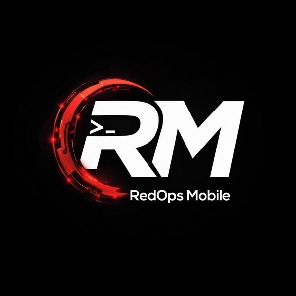
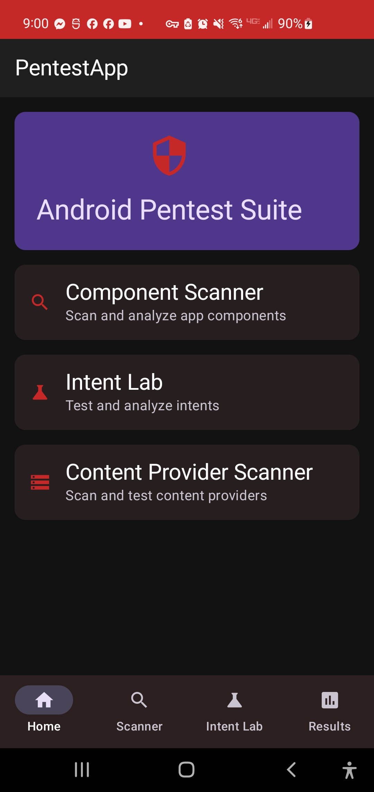
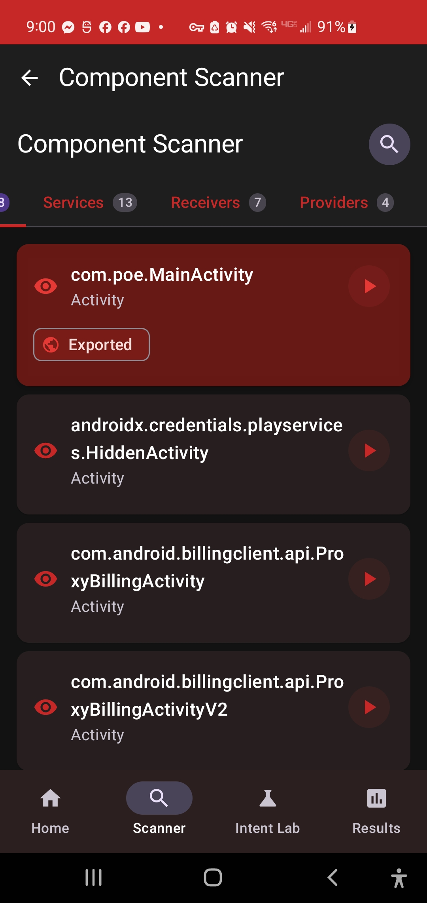
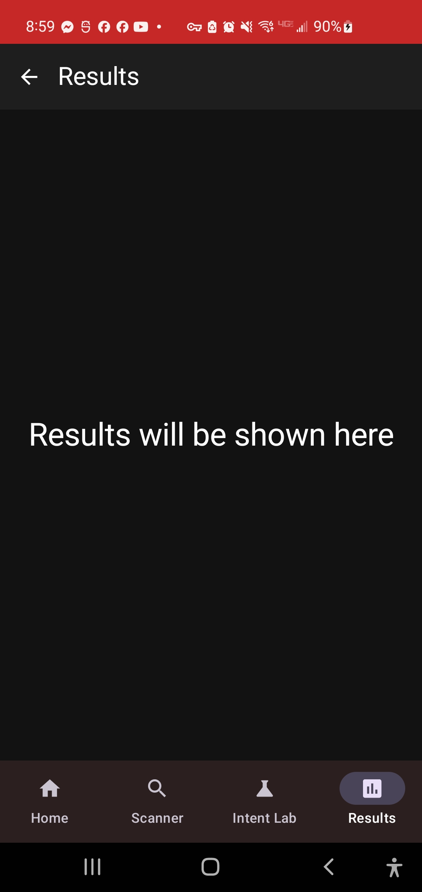

<div align="center">



# RedOps Mobile

On-device Android application security tooling for rooted phones with a Kali NetHunter chroot.

[](https://developer.android.com)
[](https://kotlinlang.org)
[](https://gradle.org)
[](#license)

</div>

RedOps Mobile is a native Android app that drives a local mobile testing stack from the device itself. The UI is written in Kotlin and Jetpack Compose; privileged operations execute through `su`, into a NetHunter chroot, and then into the `pq` tooling and agent assets deployed under `/root/pentest/`.

This repository is for a very specific operating model: rooted Android, Kali NetHunter installed, and a chroot-backed toolchain available on-device. It is not a generic Android pentesting app for stock devices.

## Status

- Rooted-device workflow only. Shizuku support is gone.
- NetHunter chroot is expected at `/data/local/nhsystem/kali-arm64`.
- The app auto-deploys `pq`, agent assets, and `pq_wrapper.sh` on startup, then uses fixed runtime paths.
- Frida server is bootstrapped through the deployment flow and stored at `/data/local/.cache/media_session_d`.
- The app is in active development and currently optimized for debug/internal use.

## What It Does

RedOps Mobile combines a native Android front end with an on-device Linux toolchain so you can inspect, instrument, and analyze target apps without moving constantly between the phone and a separate laptop.

Core workflows:

- Target analysis: select an installed package, extract metadata, scan exported components, inspect the manifest, detect the app framework, decompile with the recommended tool, and run RCE/native scans.
- Traffic capture: manage capture sessions, browse HTTP/native entries, scope results, and export data into the repeater or agent workflows.
- IPC and intent testing: enumerate exported IPC surfaces and test component entry points.
- PQ/Frida management: control Frida server lifecycle, spawn gates, and hook execution through the `pq` integration layer.
- Agent-assisted analysis: send findings, traffic, or session exports into the embedded agent workflow backed by the chroot environment.

## Requirements

### Device

- Root access via Magisk, KernelSU, APatch, or equivalent
- Android 8.0+ device or emulator image capable of the full root/chroot workflow
- Enough storage for the APK, deployed agent assets, decompilation output, and NetHunter toolchain

### On-Device Environment

- Kali NetHunter chroot installed at `/data/local/nhsystem/kali-arm64`
- A working Python virtual environment inside the chroot at `/data/local/nhsystem/kali-arm64/venv`
- Network access on first bootstrap so Frida setup can download the server binary
- `pq` and agent assets auto-deployed under `/root/pentest/` on app startup
- Working `su` access from the app

### Build Environment

- JDK 17
- Android SDK with API 35
- Gradle wrapper included in this repo
- ADB available for install/debug

## Environment Assumptions

These paths are hard-coded into the current implementation and should be treated as part of the deployment contract:

| Purpose | Path |
|---|---|
| NetHunter root | `/data/local/nhsystem/kali-arm64` |
| Chroot entry bridge | `/usr/local/bin/android-entry` |
| Python venv | `/data/local/nhsystem/kali-arm64/venv` |
| `pq` CLI | `/root/pentest/scripts/pq` |
| Host-side wrapper | `/data/local/tmp/pq_wrapper.sh` |
| Agent deployment root | `/root/pentest/` |

The app bootstraps `pq` and the bundled agent assets into these locations on startup. Frida is also provisioned automatically when missing, but runtime command execution still expects these paths to exist and be usable.

## UI Overview

The top-level app navigation is intentionally simple.

### Target

The `Target` tab is the main package workflow. A selected app is analyzed in a unified screen with four sub-tabs:

- `Overview`: package info, framework detection, extraction status, decompilation actions, native scan, RCE scan
- `Manifest`: manifest-oriented security review
- `Components`: exported activity/service/receiver/provider review and testing actions
- `Findings`: consolidated findings that can be sent into the agent flow

### Tools

The `Tools` tab groups the operational utilities:

- Traffic Capture
- HTTP Repeater
- IPC monitor and related intent workflows
- Data/SharedPreferences workflows
- PQ Manager for Frida and hook lifecycle management

### Agent

The `Agent` tab provides the chat/session workflow. It can start fresh sessions or open with preloaded context from:

- target findings
- traffic exports
- full traffic session exports
- web target setup

## Screenshots

<div align="center">



</div>

## Architecture Overview

RedOps Mobile operates across two execution environments:

1. Android host  
   The APK owns UI, app state, Room persistence, navigation, and system integration.
2. NetHunter chroot  
   Privileged tooling runs inside the Kali environment, including Python, `pq`, Frida-related workflows, decompilation support, and agent assets.

Operationally, most privileged work flows through:

`Android UI -> su -> chroot -> android-entry -> pq/tooling`

The `PqCommandExecutor` facade is the primary bridge for chroot and `pq` command execution.

## Repo Layout

```text
app/
  src/main/java/com/redops/mobile/
    core/            Shared domain, shell, root, UI, and persistence plumbing
    feature/         Feature modules such as agent, scanner, target, trafficcapture, repeater, pqmanager
    navigation/      Bottom-tab and cross-tab navigation model
    service/chroot/  NetHunter environment verification and chroot helpers
  src/main/assets/agent/
    docs/            Agent-side operational docs deployed into /root/pentest/
    skills/          Agent skills such as discovery, web-discovery, report-workflow
    templates/       Analysis/report templates
    system/          Chroot-side runtime helpers

docs/
  Product notes, interception writeups, shell docs, troubleshooting, and screenshots
```

## Core Features

### Target Analysis

- Exported component discovery and testing
- Framework detection for common mobile stacks
- Manifest inspection and vulnerability surfacing
- Data extraction status reporting
- Local or VPS-backed decompilation flows
- Native scan and RCE scan entry points

### Traffic Capture And Repeater

- Session-based traffic browsing
- HTTP and native entry handling
- Scope filtering and session selection
- Request replay and response review
- Export paths into the agent workflow

### PQ And Frida Operations

- Frida server lifecycle management
- Spawn-gate and hook launch support through `pq`
- Quick access to hook/script management from the Android UI
- Chroot command streaming and progress reporting

### Agent Workflow

- Session-based chat interface
- Context injection from findings and captures
- Asset deployment from APK assets into `/root/pentest/`
- Access to bundled skills and reference docs inside the deployed environment

## First Run

1. Build the debug APK.
2. Install it with ADB.
3. Launch the app and grant root access.
4. Confirm the NetHunter chroot exists and is accessible.
5. Confirm `/root/pentest/` assets have been deployed.
6. Open `Target`, select a package, and run the initial scan.

Example build/install flow:

```bash
./gradlew --no-daemon assembleDebug
adb install -r app/build/outputs/apk/debug/app-debug.apk
```

## Recommended Verification

Before relying on the app, verify the expected environment manually:

```bash
adb shell su -c 'test -d /data/local/nhsystem/kali-arm64 && echo chroot-ok'
adb shell su -c 'chroot /data/local/nhsystem/kali-arm64 /bin/bash -lc "python3 --version"'
adb shell su -c 'chroot /data/local/nhsystem/kali-arm64 /bin/bash -lc "test -x /root/pentest/scripts/pq && echo pq-ok"'
adb shell su -c 'test -f /data/local/.cache/media_session_d && echo frida-ok'
```

If those checks fail, fix the device/chroot setup first. The app assumes those paths exist.

## Typical Workflow

```text
Select target app
  -> review overview and extraction status
  -> scan components and inspect findings
  -> detect framework and decompile with the recommended tool
  -> run RCE/native scans if needed
  -> capture traffic and replay interesting requests
  -> send findings or session exports to the Agent
```

## Bundled Agent Assets

The APK includes agent-side documentation and skills that are deployed into `/root/pentest/`.

Bundled skills:

- `discovery`
- `rce-investigation`
- `report-workflow`
- `web-discovery`

Bundled docs include:

- `PQ_COMPREHENSIVE.md`
- `PQ.md`
- `MCP_SERVER.md`
- `WEB_PENTEST_GUIDE.md`
- `FLUTTER_CTRL_GUIDE.md`
- `DOMAIN_RECON_WORKFLOW.md`
- `GRAPHQL_ENUM.md`
- additional reference docs under `app/src/main/assets/agent/docs/`

## Documentation Map

Use the root README as the starting point, then go deeper in `docs/` and agent-side docs as needed.

Useful repo docs:

- `docs/CRONET_INTERCEPTION_DEEP_DIVE.md`
- `docs/SNAPCHAT_INTERCEPTION.md`
- `docs/Troubleshooting-Edge-Cases.md`
- `docs/Agent-Developer-Guide.md`
- `docs/shell/README.md`
- `app/Architecture.md`

## Build From Source

### Build Variants

- `debug`: primary development build
- `tracing`: debug-derived variant with agent tracing enabled
- `release`: non-minified release variant currently still oriented toward internal distribution

### Commands

```bash
# Debug
./gradlew --no-daemon assembleDebug

# Tracing
./gradlew --no-daemon assembleTracing

# Release
./gradlew --no-daemon assembleRelease
```

### APK Output

| Variant | Path |
|---|---|
| Debug | `app/build/outputs/apk/debug/app-debug.apk` |
| Tracing | `app/build/outputs/apk/tracing/app-tracing.apk` |
| Release | `app/build/outputs/apk/release/app-release.apk` |

## Dual File System Notes

Agent-facing files effectively exist in two places during development:

| Location | Purpose |
|---|---|
| `/root/pentest/` | Live deployed runtime on the device/chroot |
| `app/src/main/assets/agent/` | Source of truth packaged into the APK |

Helper scripts in the repo:

- `sync_to_source.sh`
- `compare_deployed_vs_source.sh`
- `deploy_from_source.sh`
- `sync_source_to_deployed.sh`

## Known Limitations

- Requires root and a correctly installed NetHunter chroot.
- Hard-coded environment paths make this repo less portable than a typical Android app.
- Some repo documentation still reflects older architecture or transitional states.
- The app and manifest are currently development-oriented; review settings carefully before treating any build as production-ready.

## Safety And Scope

This project is intended for authorized security testing and research on systems you are permitted to assess.

## License

Proprietary. All rights reserved.
